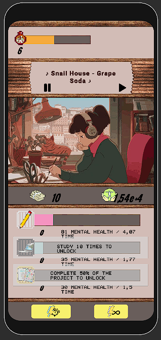

# Unidle

## membros:

- Ana Caroliza Souza
- Fabricio Neri
- Jean Silas Sanandrez

## Sobre
Unidle é um jogo idle de simulação de vida universitária para dispositivos mobile. No jogo, o desenvolvimento do jogador se baseia em investir sua saúde mental e tempo para passar nas matérias da faculdade e prosseguir na vida universítária. Quanto mais você avança, mais difícil fica o prosseguimento nas fases posteriores. 

Para seguir nesses desafios, você pode utilizar ferramentas comuns de estudantes como música lo-fi, adotar um gatinho, ir em festas universitárias e etc. para ganhar bônus nas fases.

## Resultado final

A imagem apresenta uma das telas de desenvolvimento do jogo, onde o jogador se desenvolve nos desafios da faculdade.

## GDD

Para o desenvolvimento do jogo, foi utilizado um GDD, uma ferramenta de design de jogos para alinhar entre os membros da equipe expectativas e objetivos de desenvolvimento. O plano do GDD pode ser verificado a seguir: https://app.milanote.com/1PW8QM1qfhbq1N?p=va89TJv4J5V 
